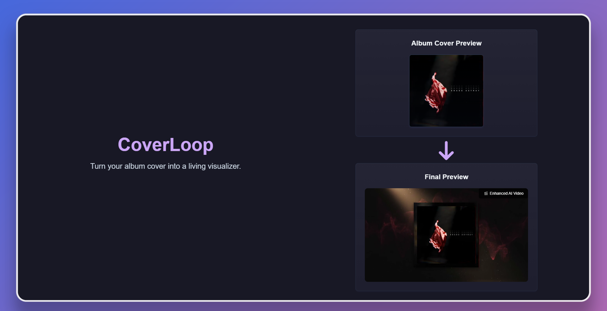

**CoverLoop** transforms static album covers into **living, looping music visualizers**.
By combining Gemini image models, fal.ai video generation, and in‑browser rendering, artists can quickly create engaging visuals to enhance their music presentations and use them for YouTube, Spotify Canvas, TikTok, or live shows.

By uploading an album cover, the system automatically interprets its theme, generates a matching animated background, and composites the original artwork on top, producing a looping visualizer synced to audio.

## ⚙️ Technical Details

The pipeline for CoverLoop combines **Gemini models**, **fal.ai video generation**, and **FFmpeg.wasm** for in‑browser rendering:

1. **Album Cover Analysis (Gemini 2.0 Flash)**

   - Extracts a **textual description**, **style**, and **color palette** from the uploaded album cover.

2. **Background Generation (Gemini 2.5 Flash Image Preview)**

   - Generates a new **background image** based on the extracted description and palette.
   - Creates a thematically consistent but expanded “world” around the cover.

3. **Video Animation (fal.ai / wan‑i2v)**

   - Animates the background image into a short looping video.
   - Chosen for being **fast and cost‑efficient**.

4. **Album Cover Compositing (FFmpeg.wasm)**

   - The original static cover is re‑composited on top of the animated background.
   - Ensures the cover remains sharp and undistorted.
   - All rendering happens **client‑side in the browser**.

5. **Audio Integration & Looping (FFmpeg.wasm)**

   - Users can upload an **audio file** (song or snippet).
   - The video loop is automatically **extended or repeated** to match the audio’s duration.
   - Final output is a synced music visualizer video.

6. **Final Output**
   - A **looping MP4/WebM video**: a living album cover with an animated background, synced to audio.

\* For platforms like **Spotify Canvas, TikTok, and live visuals**, additional development is needed to support **custom aspect ratios (9:16, 1:1, 16:9, etc.)**, text overlays, and multiple background pattern options.

## 🚀 Getting Started

### Prerequisites

- Node.js 22+
- [pnpm](https://pnpm.io/) package manager
- API keys:
  - `GEMINI_API_KEY` (for Gemini models)
  - `FAL_KEY` (for fal.ai)

### Installation

```bash
git clone https://github.com/yourusername/coverloop.git
cd coverloop
pnpm install
```

### Environment Variables

Create a `.env.local` file in the project root with:

```bash
GEMINI_API_KEY=your_gemini_api_key_here
FAL_KEY=your_fal_api_key_here
```

### Development

```bash
pnpm dev
```

Open [http://localhost:3000](http://localhost:3000) in your browser.

## 🎥 Demo Flow

1. Upload an album cover.
2. Gemini analyzes the cover → extracts description + palette.
3. Gemini generates a matching background image.
4. fal.ai animates the background into a loop.
5. The original cover is composited on top.
6. (Optional) Upload audio → video loops to match track length.
7. Download the final looping visualizer.

## 🔮 Future Work

- Full editor with:
  - Position controls for album cover
  - Text overlays and captions
  - Multiple background pattern options
  - Aspect ratio presets (Spotify Canvas, TikTok, YouTube, etc.)
- Improved seamless looping with advanced video models
- Cloud export and sharing options
